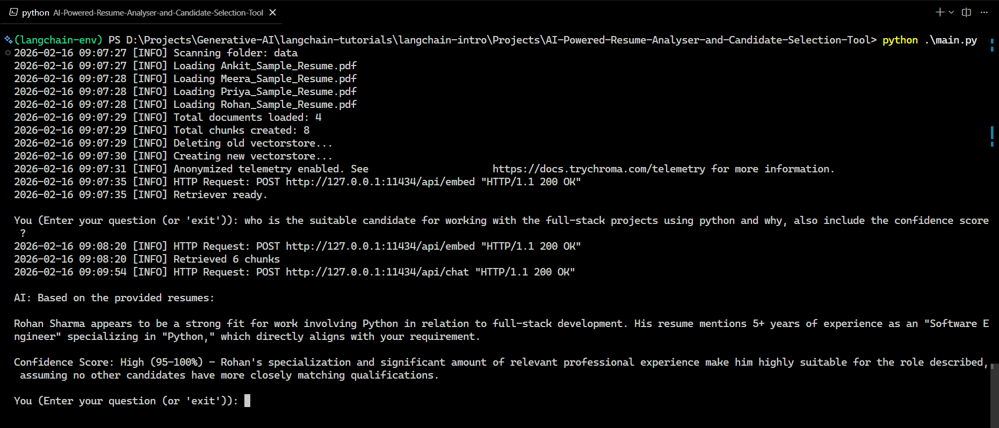

# AI-Powered Resume Analyser and Candidate Selction


## Summary

AI-Powered Resume Analyser and Candidate Selction is a lightweight, local-first resume ingestion and question-answering tool built with LangChain components, Ollama embeddings/LLMs and Chroma vector store. It converts PDF resumes into searchable vectors and provides an interactive prompt to query candidate details (skills, experience, education, etc.).

## Screenshot:


For deeper documentation and implementation notes, see [here](details.md). 

## Key Features

- PDF resume ingestion and text extraction
- Document chunking for better retrieval
- Embedding generation via Ollama (`nomic-embed-text`) and vector storage with Chroma
- Chat-style question-answering using a local Ollama LLM
- Fast, minimal dependency surface — designed for local/private usage

## Project Layout

- `main.py` — primary script: loads PDFs from `data/`, creates a Chroma vectorstore at `vectorstore/`, and starts an interactive QA loop.
- `data/` — place PDF resumes here (project expects `*.pdf`).
- `vectorstore/` — created by the app to persist embeddings (safe to delete and rebuild).

## Requirements

- Python 3.11+ (virtual environment recommended)
- Ollama installed and running locally (for the Ollama embeddings & chat models)
- A working Chroma backend (the project uses the lightweight local Chroma bindings)
- Recommended packages are captured in `requirements.txt` for this project environment — install into a venv.

Example core Python packages used:

- `langchain_community`, `langchain_core`, `langchain_ollama`, `langchain_chroma`, `langchain_text_splitters`, `PyPDFLoader` (via the loader), and `shutil` (stdlib).

## Setup (Quick)

1. Create and activate a virtual environment:

```powershell
python -m venv .venv
.\.venv\Scripts\Activate.ps1   # PowerShell
# or: .\.venv\Scripts\activate.bat  # cmd.exe
```

1. Install dependencies:

```powershell
pip install -r requirements.txt
```

3. Ensure Ollama is installed and the models referenced in `main.py` are available locally. For embeddings the code uses `nomic-embed-text`; for chat it uses `phi4-mini:3.8b` by default. Start Ollama if required.

4. Add one or more PDF resumes to the `data/` folder.

## Run

From the project root (where `main.py` lives):

```powershell
python main.py
```

The script will:

- Read all `*.pdf` files from `data/`
- Chunk documents and create embeddings with Ollama
- Persist a Chroma vectorstore to `vectorstore/`
- Open an interactive prompt where you can ask questions about the resumes (type `exit` to quit)

Example query:

```
What are the key skills listed by Anikit ?
```

## Configuration & Notes

- Model choices are in `main.py` (`llm` and `OllamaEmbeddings`). Change these if you want different models.
- If the `vectorstore/` directory exists the script will delete it and recreate the vectorstore on each run — modify `main.py` if you want to preserve or update incrementally.
- The prompt template in `main.py` is tuned to act as a senior technical recruiter; adjust `prompt_tempate` to change behavior.

## Troubleshooting

- If PDFs fail to load, verify they are valid PDF files and readable by the process.
- If Ollama embedding/LLM calls fail, ensure Ollama daemon is running and the named models are installed.
- Permission errors when creating `vectorstore/` — check file permissions and run from a directory where you can create files.

## Security & Privacy

This project runs locally and uses local models/embeddings (Ollama + Chroma). Do not place sensitive resumes in shared or public folders if you cannot guarantee access controls.

## Contributing

PRs welcome. For changes that alter ingestion, embedding models, or storage layout, include notes in the PR explaining backwards compatibility.

## License & Contact

This repository include a license by MIT.

For questions or to open an issue, contact the project maintainer.
 